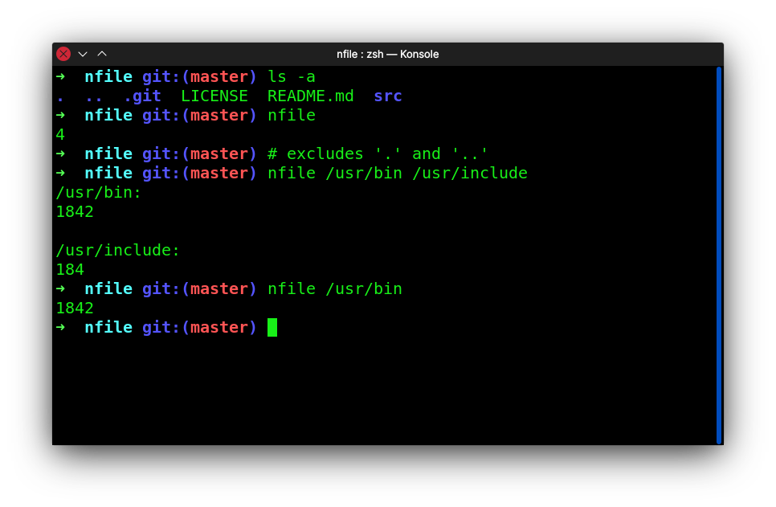

# nfile
Displays the count of files.

## Syntax
nfile [path] ...

## Screenshot


## Install

```
git clone https://github.com/sonydotgit/nfile.git
```
```
sudo gcc -o /usr/local/bin/nfile nfile/src/decs.c nfile/src/nfile.c
```

